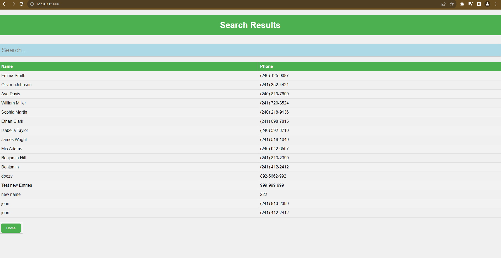
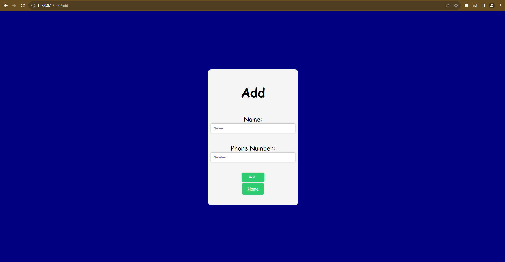
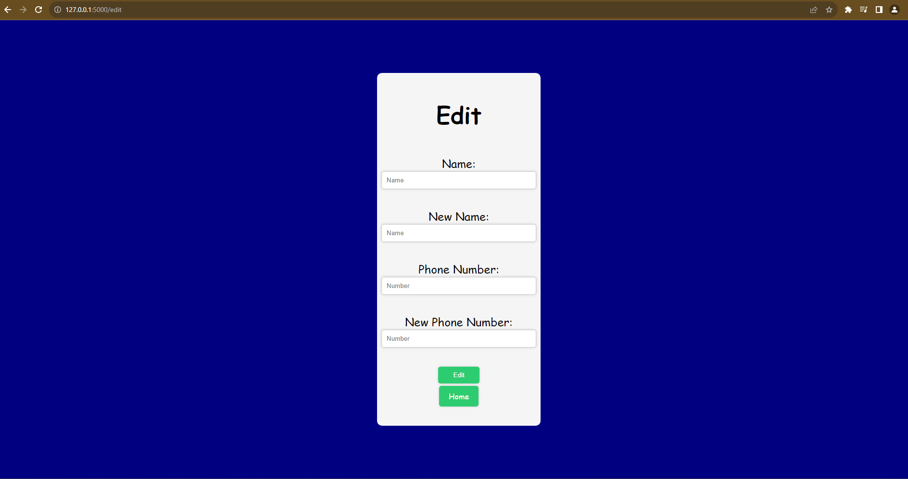
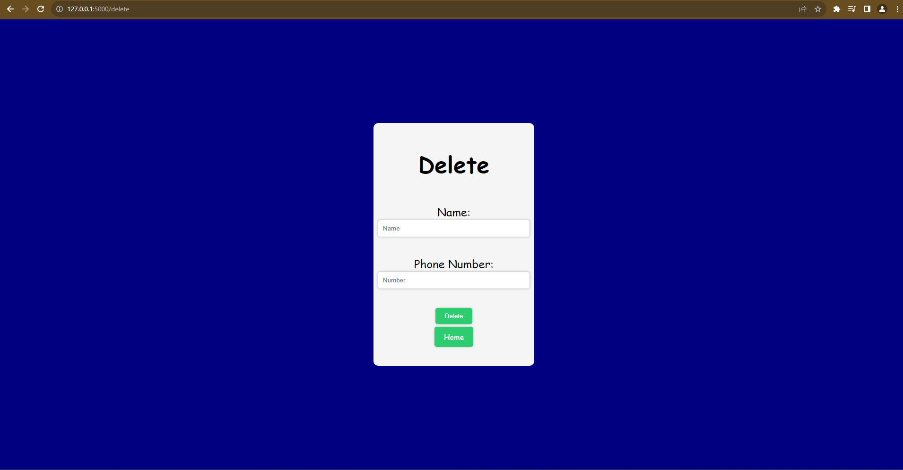
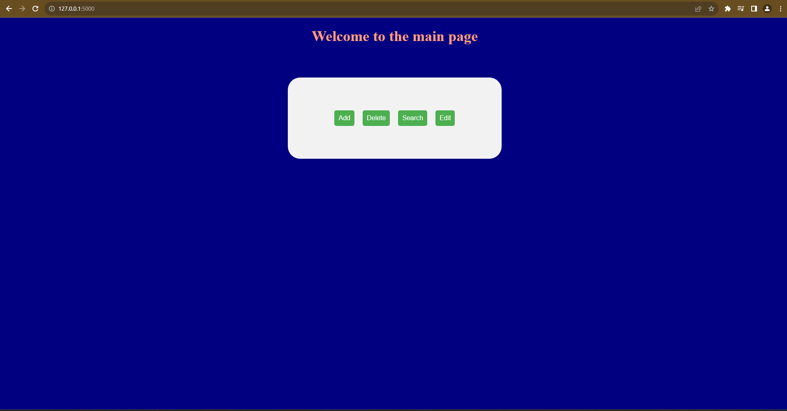

# Flask-PhoneBook
# Phone Book Web Application






```shall
Check th Demo here below:
```
```
showcase.md
```


Welcome to the Phone Book Web Application! This application allows you to manage a simple phone book through a web interface. You can add, search for, edit, and delete entries in your phone book.
## Tools


```shell
HTML
```
```shell
CSS
```
```shell
Flask Framework
```
```shell
Python
```
```shell
JavaScript
```


## How to Use

### Installation

Before you start using the Phone Book Web Application, make sure you have Python and Flask installed on your system.

```shell
pip install Flask
```

### Running the Application

To run the application, follow these steps:

1. Save the provided code to a Python file, for example, `app.py`.

2. Open your terminal or command prompt and navigate to the directory where you saved the `app.py` file.

3. Run the application by executing the following command:

```shell
python app.py
```

4. You should see output indicating that the Flask development server is running. By default, the application will run on `http://127.0.0.1:5000/`.

5. Open your web browser and go to `http://127.0.0.1:5000/` to access the Phone Book Web Application.

### Functionality

#### 1. Adding an Entry

- Click on the "Add Entry" link in the navigation menu.

- Fill in the name and phone number fields, then click the "Add" button.

- The entry will be added to your phone book, and you will be redirected to the home page.

#### 2. Searching for Entries

- Click on the "Search" link in the navigation menu.

- Enter either a name or a phone number in the search fields.

- Click the "Search" button.

- If matching entries are found, they will be displayed in a table format.

- If no entries match your search criteria, a message will indicate that no entries were found.

#### 3. Editing an Entry

- Click on the "Edit Entry" link in the navigation menu.

- Enter the name and phone number of the entry you want to edit, along with the new name and phone number.

- Click the "Edit" button.

- If the entry is found and successfully edited, you will be redirected to the search results page.

- If the entry is not found, you will see a message indicating that the entry was not found.

#### 4. Deleting an Entry

- Click on the "Delete Entry" link in the navigation menu.

- Enter the name and phone number of the entry you want to delete.

- Click the "Delete" button.

- If the entry is found and successfully deleted, you will be redirected to the home page.

#### 5. Home Page

- The home page displays the current entries in your phone book.

- From here, you can access other features of the application, such as adding, searching, editing, or deleting entries.

### Important Notes

- Entries are stored in a text file named "phone_book.txt" in the same directory as the application.

- Please make sure to provide valid input when adding, editing, or searching for entries.

- The application runs in debug mode by default (`app.run(debug=True)`), which provides detailed error messages. In a production environment, you should disable debug mode for security reasons.

<!-- Enjoy using the Phone Book Web Application to manage your contacts! -->
